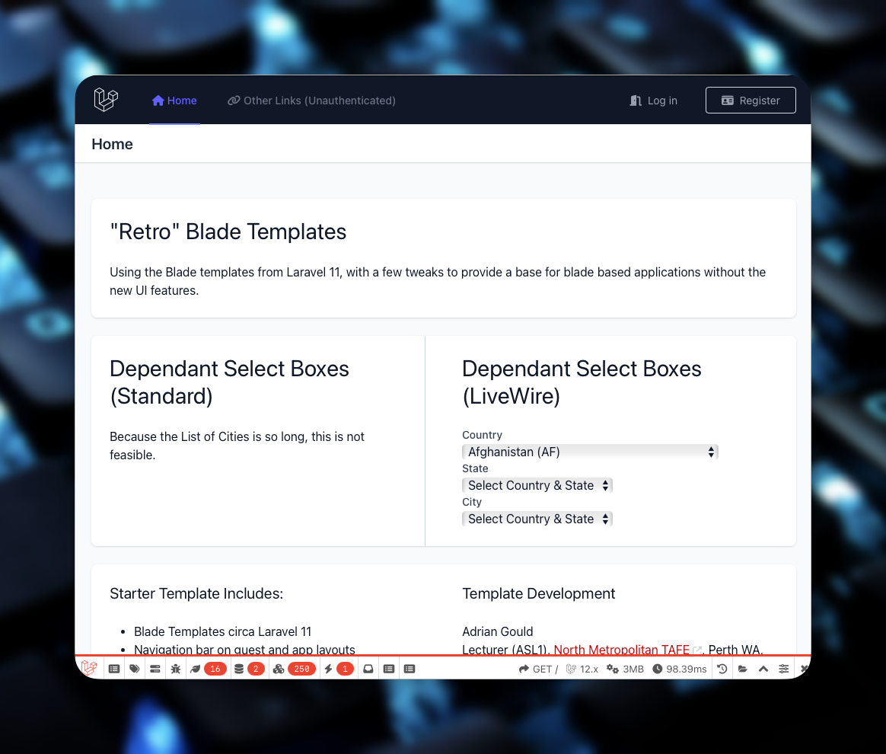

# Livewire Country-State-City dropdown in Laravel 12
<a name="readme-top"></a>

#### Built With

[![PHP][Php.com]][Php-url]
[![Laravel][Laravel.com]][Laravel-url]
[![Tailwindcss][Tailwindcss.com]][Tailwindcss-url]
[![Livewire][Livewire.com]][Livewire-url]
[![Inertia][Inertia.com]][Inertia-url]


## Description

A small demo application using AdyGCode's Retro Blade Starter kit, and Livewire.

This demo has 3 drop down select boxes, which provide a filter for each other. The country 
provides a list of states/provinces/counties/etc from which when a state is selected, the 
cities are listed.

This repo is arge due to the JSON documents containing the raw data for the application.

<p align="right">(<a href="#readme-top">back to top</a>)</p>


## Table of Contents

TO DO: Add extra, or update the contents as needed, then remove this line.

- [Description](#description)
- [Installation](#installation)
- [Usage](#usage)
- [Credits](#credits)
- [Licence](#licence)
- [Badges](#badges)
- [Features](#features)
- [Tests](#tests)
- [Contact](#contact)

## Installation

Clone the repository:

```shell
git clone https://github.com/adygcode/saas-fed-l12-world
```

Change into the new directory:
```shell
cd saas-fed-l12-world
```

Install packages
```shell
composer install
npm i
```

Update packages if you wish:
```shell
composer update
```

Initialise the (SQLite) database:

```shell
touch databases/database.sqlite
```

Copy `.env.dev` to `.env`:

```shell
cp .env.dev .env
```

Perform migrations, seeds and key generation:

```shell
php artisan key:generate
php artisan migrate:fresh --seed
```

Run the demo app:
```shell
composer run dev
```

Open http://localhost:8000

You should see:




### Demo Animation


<p align="right">(<a href="#readme-top">back to top</a>)</p>


## Credits

- Font Awesome. (n.d.). Fontawesome.com. https://fontawesome.com
- Laravel - The PHP Framework For Web Artisans. (2011). Laravel.com. https://laravel.com
- Laravel Bootcamp - Learn the PHP Framework for Web Artisans. (n.d.). Bootcamp.laravel.com. https://bootcamp.laravel.com/
- PHP: Hypertext Preprocessor. (n.d.). Www.php.net. https://php.net
- Professional README Guide. (n.d.). Coding-Boot-Camp.github.io. Retrieved April 15, 2024, from https://coding-boot-camp.github.io/full-stack/github/professional-readme-guide
- TailwindCSS. (2023). Tailwind CSS - Rapidly build modern websites 
  without ever leaving your HTML. Tailwindcss.com. https://tailwindcss.com/
- Korop, P. (2025). 23 - Dependent Dropdowns: Country and Cities | Laravel Daily. Laraveldaily.com. https://laraveldaily.com/lesson/livewire-3/dependent-dropdowns-country-cities


<p align="right">(<a href="#readme-top">back to top</a>)</p>


## Badges

<!-- PROJECT SHIELDS -->
<!--
*** I'm using markdown "reference style" links for readability.
*** Reference links are enclosed in brackets [ ] instead of parentheses ( ).
*** See the bottom of this document for the declaration of the reference variables
*** for contributors-url, forks-url, etc. This is an optional, concise syntax you may use.
*** https://www.markdownguide.org/basic-syntax/#reference-style-links
***
*** Forks, Issues and Licence Shields will NOT appear for Private Repos.
*** You may want to remove this section for this assessment.
*** Delete this block of comments once you have edited this ReadMe.
***
***
-->

[![Forks][forks-shield]][forks-url]
[![Issues][issues-shield]][issues-url]
[![Educational Community Licence][licence-shield]][licence-url]


<p align="right">(<a href="#readme-top">back to top</a>)</p>


## Contact

Adrian Gould - @twitter_handle - email@email_client.com

Project Link: https://github.com/adygcode/saas-fed-l12-world

<p align="right">(<a href="#readme-top">back to top</a>)</p>


## Licence

TO DO: Summarise/define the Licence here. Link to the Licence file.

The last section of a high-quality README file is the licence. This lets other
developers know what they can and cannot do with your project. If you need
help choosing a licence, refer
to [https://choosealicense.com/](https://choosealicense.com/).


<p align="right">(<a href="#readme-top">back to top</a>)</p>


---

<!-- MARKDOWN LINKS & IMAGES -->
<!-- https://www.markdownguide.org/basic-syntax/#reference-style-links -->

[forks-shield]: http://img.shields.io/github/forks/adygcode/saas-fed-l12-world.svg?style=for-the-badge

[forks-url]: https://github.com/AdyGCode/saas-fed-l12-world/network/members

[issues-shield]: http://img.shields.io/github/issues/adygcode/saas-fed-l12-world.svg?style=for-the-badge

[issues-url]: https://github.com/adygcode/saas-fed-l12-world/issues

[licence-shield]: https://img.shields.io/github/license/adygcode/saas-fed-l12-world.svg?style=for-the-badge

[licence-url]: https://github.com/adygcode/saas-fed-l12-world/blob/main/License.md

[product-screenshot]: images/screenshot.png

[Laravel.com]: https://img.shields.io/badge/Laravel-FF2D20?style=for-the-badge&logo=laravel&logoColor=white

[Laravel-url]: https://laravel.com

[Tailwindcss.com]: https://img.shields.io/badge/Tailwindcss-06B6D4?style=for-the-badge&logo=tailwindcss&logoColor=white

[Tailwindcss-url]: https://tailwindcss.com

[Livewire.com]: https://img.shields.io/badge/Livewire-4E56A6?style=for-the-badge&logo=livewire&logoColor=white

[Livewire-url]: https://livewire.laravel.com

[Inertia.com]: https://img.shields.io/badge/Inertia-9553E9?style=for-the-badge&logo=inertia&logoColor=white

[Inertia-url]: https://inertiajs.com

[Php.com]: https://img.shields.io/badge/Php-777BB4?style=for-the-badge&logo=php&logoColor=white

[Php-url]: https://inertiajs.com
